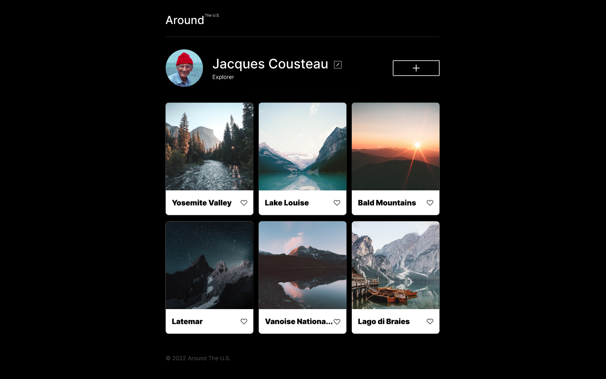
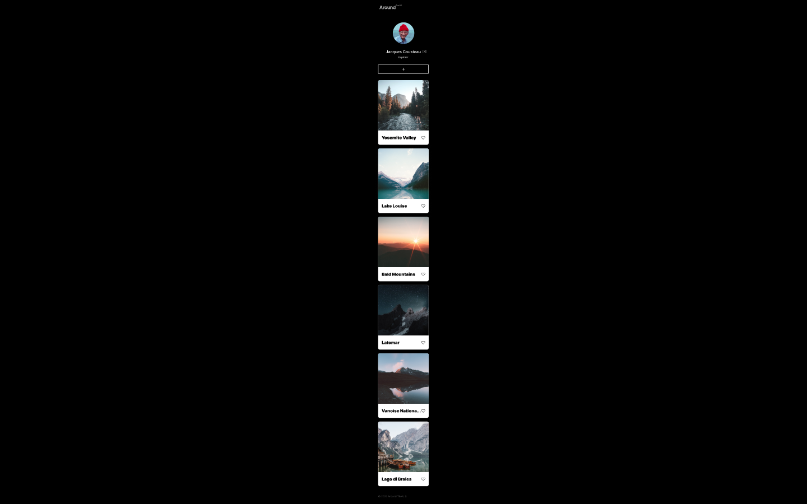

# Project 3: Around The U.S.

### Overview

- Intro
- Figma
- Images
- HTML
- CSS
- Grid
- Responsive Design

  **Description**

This project is made so all the elements are displayed correctly on popular screen sizes. An interactive page where users can add and remove photos, like photos of other users, and make a few minor adjustments to their own profile.

**link**

- [Link to the project on GitHub Pages](https://juancr-0101.github.io/se_project_aroundtheus/)

**Images**

Take a look of how the interactive page will look on both desktop and mobile!

